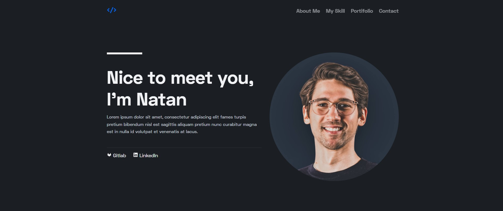

<h1 align="center"> My Portifolio Project </h1>

Projeto realizado para compreender e aperfeiçoar técnicas em react.

  <a href="#-tecnologias">Tecnologias</a>&nbsp;&nbsp;&nbsp;|&nbsp;&nbsp;&nbsp;
  <a href="#-projeto">Projeto</a>&nbsp;&nbsp;&nbsp;|&nbsp;&nbsp;&nbsp;
  <a href="#memo-licença">Licença</a>

  

 

  

## 💻Instalaçao

- npm install
- npm start

## 🚀 Tecnologias

Esse projeto foi desenvolvido com as seguintes tecnologias:

- HTML e CSS
- JavaScript
- SCSS
- React
- NPM
- React-Icons

## 💻 Projeto

Projeto realizado para compreender e aperfeiçoar técnicas em react, sendo a componentização de um projeto, utilizar states e hooks.

## :memo: Licença

Esse projeto está sob a licença MIT.

---

Feito com ♥ by Natan Martins dos Santos :wave:
